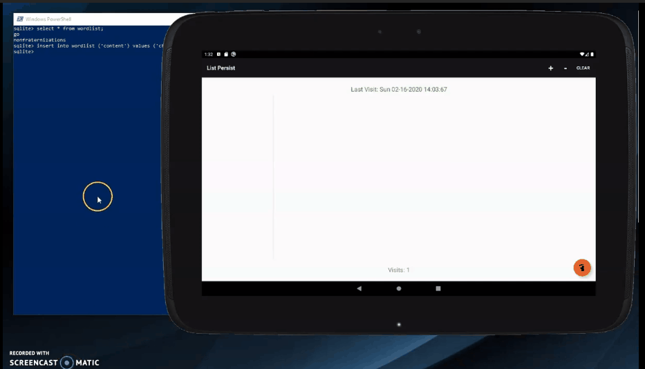

## List Persist

Generates list of random words that persist on application close. The words list can be modified or queried through SQLite.

# Technologies used

 - Android Studio
 - SQLite3
 - Nexus 10 API 29

# What I learned

 - Database to app integration
 - Persist data on application termination

# Demo

